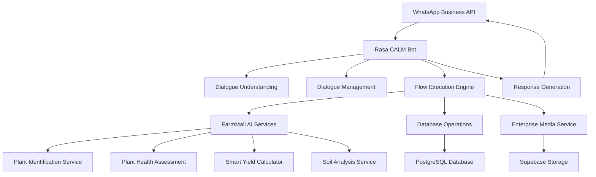

# 🤖 FarmMall Conversational AI Implementation Guide
## Rasa CALM Integration for WhatsApp-Based Agriculture Assistant

---

## 📋 Executive Summary

This document outlines the implementation of a **Rasa CALM (Conversational AI with Language Models)** powered conversational bot for FarmMall's agriculture platform. The bot will integrate with WhatsApp to provide farmers with:

- **Farming activity and expense logging** via chat
- **Pest/disease identification** using camera integration
- **Automated reminders and agricultural updates**
- **Smart yield predictions and recommendations**

---

## 🏗️ System Architecture Overview

### **Core Components Integration**



### **Existing FarmMall AI Capabilities to Leverage**

Your platform already has these AI services that the conversational bot will integrate with:

1. **🌱 Plant Identification Service** (`PlantIdentificationService`)
   - Gemini AI + Plant.id fallback
   - Identifies plants from images with 95%+ confidence
   - Provides cultivation tips and characteristics

2. **🏥 Plant Health Assessment** (`PlantHealthService`)
   - Analyzes plant diseases and health status
   - Provides treatment recommendations
   - Kenya-specific regional advice

3. **🧮 Smart Yield Calculator** (`SmartYieldCalculatorService`)
   - Economic projections and risk assessment
   - Market analysis and profitability insights
   - Kenya-focused recommendations

4. **🌍 Soil Analysis Service** (`SoilAnalysisService`)
   - PDF and image processing
   - Fertilization recommendations
   - Crop suitability analysis

5. **📁 Enterprise Media Service** (`EnterpriseMediaService`)
   - Image processing and storage
   - Variant generation (thumbnails, etc.)
   - Supabase integration

---

## 🎯 Conversation Flow Design

### **Primary Conversation Flows**

#### **1️⃣ Activity Logging Flow**
```yaml
flows:
  log_farming_activity:
    name: "Log Farming Activity"
    description: "Help farmers record daily farming activities and expenses"
    
    steps:
      - id: "greet_activity"
        action: "utter_activity_greeting"
        
      - id: "collect_activity_type"
        collect: "activity_type"
        description: "What type of activity? (planting, watering, fertilizing, harvesting, etc.)"
        
      - id: "collect_crop_details"
        collect: "crop_type"
        description: "Which crop is this for?"
        
      - id: "collect_area_size"
        collect: "farm_area"
        description: "What's the area size? (in acres)"
        
      - id: "collect_expense"
        collect: "expense_amount"
        description: "Any expenses for this activity? (in KES)"
        
      - id: "collect_notes"
        collect: "activity_notes"
        description: "Any additional notes?"
        
      - id: "save_activity"
        action: "action_save_farming_activity"
        
      - id: "confirm_saved"
        action: "utter_activity_saved"

slots:
  activity_type:
    type: text
    description: "Type of farming activity being logged"
  crop_type:
    type: text
    description: "Crop variety being worked on"
  farm_area:
    type: float
    description: "Size of area in acres"
  expense_amount:
    type: float
    description: "Cost in Kenya Shillings"
  activity_notes:
    type: text
    description: "Additional farmer notes"
```

#### **2️⃣ Plant Health Diagnosis Flow**
```yaml
flows:
  diagnose_plant_health:
    name: "Plant Health Diagnosis"
    description: "Analyze plant images for diseases and pests"
    
    steps:
      - id: "request_plant_image"
        action: "utter_request_plant_photo"
        
      - id: "collect_plant_image"
        collect: "plant_image"
        description: "Please share a clear photo of your plant"
        
      - id: "collect_plant_type"
        collect: "suspected_plant_type"
        description: "What type of plant is this? (potato, maize, tomato, etc.)"
        
      - id: "collect_symptoms"
        collect: "observed_symptoms"
        description: "What symptoms do you see? (yellowing, spots, wilting, etc.)"
        
      - id: "collect_location"
        collect: "farm_location"
        description: "What's your location? (for region-specific advice)"
        
      - id: "analyze_plant_health"
        action: "action_analyze_plant_health"
        
      - id: "present_diagnosis"
        action: "utter_health_diagnosis_results"
        
      - id: "offer_treatment_plan"
        action: "utter_treatment_recommendations"

slots:
  plant_image:
    type: text
    description: "Base64 encoded plant image or file path"
  suspected_plant_type:
    type: categorical
    values: ["potato", "maize", "beans", "tomato", "onion", "cabbage", "carrot"]
  observed_symptoms:
    type: list
    description: "List of symptoms observed by farmer"
  farm_location:
    type: text
    description: "GPS coordinates or county/subcounty"
```

#### **3️⃣ Yield Prediction Flow**
```yaml
flows:
  predict_crop_yield:
    name: "Crop Yield Prediction"
    description: "Calculate expected yields and profitability"
    
    steps:
      - id: "collect_crop_details"
        collect: "crop_for_prediction"
        description: "Which crop do you want yield prediction for?"
        
      - id: "collect_farm_size"
        collect: "total_farm_size"
        description: "What's your total farm size in acres?"
        
      - id: "collect_planting_date"
        collect: "planting_date"
        description: "When did you plant? (or when will you plant?)"
        
      - id: "collect_farming_method"
        collect: "farming_method"
        description: "What farming method? (traditional, organic, modern irrigation, etc.)"
        
      - id: "collect_location_yield"
        collect: "location_for_yield"
        description: "What's your location for weather and market analysis?"
        
      - id: "calculate_yield"
        action: "action_calculate_smart_yield"
        
      - id: "present_yield_prediction"
        action: "utter_yield_prediction_results"
        
      - id: "offer_optimization_tips"
        action: "utter_yield_optimization_tips"
```

#### **4️⃣ Expense Tracking Flow**
```yaml
flows:
  track_farm_expenses:
    name: "Farm Expense Tracking"
    description: "Log and categorize farming expenses"
    
    steps:
      - id: "collect_expense_type"
        collect: "expense_category"
        description: "What type of expense? (seeds, fertilizer, labor, equipment, etc.)"
        
      - id: "collect_expense_amount"
        collect: "expense_cost"
        description: "How much did it cost? (in KES)"
        
      - id: "collect_expense_date"
        collect: "expense_date"
        description: "When was this expense? (today, yesterday, specific date)"
        
      - id: "collect_expense_supplier"
        collect: "supplier_name"
        description: "Where did you buy it? (supplier name - optional)"
        
      - id: "collect_expense_notes"
        collect: "expense_description"
        description: "Any details about this expense?"
        
      - id: "save_expense"
        action: "action_save_farm_expense"
        
      - id: "show_expense_summary"
        action: "utter_expense_saved_summary"
```

#### **5️⃣ Agricultural Reminders Flow**
```yaml
flows:
  set_farming_reminders:
    name: "Set Farming Reminders"
    description: "Schedule automated farming activity reminders"
    
    steps:
      - id: "collect_reminder_type"
        collect: "reminder_activity"
        description: "What activity do you want to be reminded about?"
        
      - id: "collect_reminder_frequency"
        collect: "reminder_schedule"
        description: "How often? (daily, weekly, monthly, one-time)"
        
      - id: "collect_reminder_time"
        collect: "reminder_time"
        description: "What time of day? (morning, afternoon, evening, specific time)"
        
      - id: "collect_reminder_crop"
        collect: "reminder_crop"
        description: "Which crop is this reminder for?"
        
      - id: "create_reminder"
        action: "action_create_farming_reminder"
        
      - id: "confirm_reminder"
        action: "utter_reminder_created"
```

---

## 🛠️ Technical Implementation

### **1. Rasa CALM Configuration**

```yaml
# config.yml
recipe: default.v1
language: en

pipeline:
  - name: WhitespaceTokenizer
  - name: RegexFeaturizer
  - name: LexicalSyntacticFeaturizer
  - name: CountVectorsFeaturizer
  - name: CountVectorsFeaturizer
    analyzer: char_wb
    min_ngram: 1
    max_ngram: 4
  - name: DIETClassifier
    epochs: 100
    constrain_similarities: true
  - name: EntitySynonymMapper
  - name: ResponseSelector
    epochs: 100
    constrain_similarities: true
  - name: FallbackClassifier
    threshold: 0.3
    ambiguity_threshold: 0.1

policies:
  - name: MemoizationPolicy
  - name: RulePolicy
  - name: UnexpecTEDIntentPolicy
    max_history: 5
    epochs: 100
  - name: TEDPolicy
    max_history: 5
    epochs: 100
    constrain_similarities: true

# CALM Configuration
assistant_id: "farmmall_agriculture_assistant"
dialogue_understanding:
  llm:
    type: "openai"
    model_name: "gpt-4"
    api_key: "${OPENAI_API_KEY}"
  
dialogue_management:
  max_turns: 50
  fallback_action: "utter_fallback"
```

### **2. Custom Actions Integration**

```python
# actions/actions.py
from typing import Any, Text, Dict, List
from rasa_sdk import Action, Tracker
from rasa_sdk.executor import CollectingDispatcher
from rasa_sdk.events import SlotSet
import requests
import base64
from datetime import datetime

class ActionAnalyzePlantHealth(Action):
    def name(self) -> Text:
        return "action_analyze_plant_health"

    async def run(
        self,
        dispatcher: CollectingDispatcher,
        tracker: Tracker,
        domain: Dict[Text, Any],
    ) -> List[Dict[Text, Any]]:
        
        # Get slot values
        plant_image = tracker.get_slot('plant_image')
        plant_type = tracker.get_slot('suspected_plant_type')
        symptoms = tracker.get_slot('observed_symptoms')
        location = tracker.get_slot('farm_location')
        user_id = tracker.sender_id
        
        try:
            # Convert WhatsApp image to proper format
            image_data = self.process_whatsapp_image(plant_image)
            
            # Call FarmMall Plant Health API
            health_analysis = await self.call_plant_health_api(
                user_id=user_id,
                image_data=image_data,
                plant_type=plant_type,
                symptoms=symptoms,
                location=location
            )
            
            if health_analysis.get('success'):
                result = health_analysis['data']
                
                # Format results for WhatsApp
                diagnosis_message = self.format_health_diagnosis(result)
                
                dispatcher.utter_message(text=diagnosis_message)
                
                # Store diagnosis in slots
                return [
                    SlotSet("health_diagnosis", result),
                    SlotSet("analysis_confidence", result.get('confidence', 0)),
                    SlotSet("is_plant_healthy", result.get('healthStatus', {}).get('isHealthy', False))
                ]
            else:
                dispatcher.utter_message(
                    text="Sorry, I couldn't analyze your plant image. Please try again with a clearer photo."
                )
                return []
                
        except Exception as e:
            dispatcher.utter_message(
                text="There was an error analyzing your plant. Our technical team has been notified."
            )
            return []

    async def call_plant_health_api(self, user_id: str, image_data: bytes, 
                                  plant_type: str, symptoms: list, location: str):
        """Call FarmMall's existing plant health API"""
        
        api_url = "http://localhost:3000/api/v1/enhanced-plant/health-assessment/upload"
        
        files = {
            'image': ('plant.jpg', image_data, 'image/jpeg')
        }
        
        data = {
            'cropType': plant_type,
            'location': json.dumps({
                'latitude': -1.2921,  # Default to Nairobi, parse from location if available
                'longitude': 36.8219
            }),
            'symptoms': json.dumps(symptoms or [])
        }
        
        headers = {
            'Authorization': f'Bearer {self.get_user_token(user_id)}'
        }
        
        async with aiohttp.ClientSession() as session:
            async with session.post(api_url, data=data, files=files, headers=headers) as response:
                return await response.json()

    def format_health_diagnosis(self, result: dict) -> str:
        """Format health diagnosis for WhatsApp display"""
        
        health_status = result.get('healthStatus', {})
        diseases = result.get('diseases', [])
        treatments = result.get('treatmentRecommendations', {})
        
        message = f"🔍 **Plant Health Analysis Results**\n\n"
        
        # Health Status
        if health_status.get('isHealthy'):
            message += "✅ **Good news!** Your plant appears healthy.\n\n"
        else:
            message += "⚠️ **Issues detected** with your plant.\n\n"
        
        # Diseases
        if diseases:
            message += "🦠 **Detected Issues:**\n"
            for disease in diseases[:3]:  # Limit to top 3
                confidence = disease.get('confidence', 0) * 100
                message += f"• {disease.get('name', 'Unknown')} ({confidence:.0f}% confidence)\n"
                message += f"  {disease.get('description', '')[:100]}...\n\n"
        
        # Treatment Recommendations
        immediate_treatments = treatments.get('immediate', [])
        if immediate_treatments:
            message += "💊 **Immediate Treatment:**\n"
            for treatment in immediate_treatments[:2]:
                message += f"• {treatment}\n"
            message += "\n"
        
        # Organic treatments
        organic_treatments = treatments.get('organic', [])
        if organic_treatments:
            message += "🌿 **Organic Options:**\n"
            for treatment in organic_treatments[:2]:
                message += f"• {treatment}\n"
            message += "\n"
        
        message += "📞 Type 'more details' for complete analysis or 'new diagnosis' for another plant."
        
        return message

class ActionSaveFarmingActivity(Action):
    def name(self) -> Text:
        return "action_save_farming_activity"

    async def run(
        self,
        dispatcher: CollectingDispatcher,
        tracker: Tracker,
        domain: Dict[Text, Any],
    ) -> List[Dict[Text, Any]]:
        
        # Extract activity details from slots
        activity_type = tracker.get_slot('activity_type')
        crop_type = tracker.get_slot('crop_type')
        farm_area = tracker.get_slot('farm_area')
        expense_amount = tracker.get_slot('expense_amount')
        activity_notes = tracker.get_slot('activity_notes')
        user_id = tracker.sender_id
        
        # Prepare activity data
        activity_data = {
            'userId': user_id,
            'activityType': activity_type,
            'cropType': crop_type,
            'areaSize': farm_area,
            'expenseAmount': expense_amount or 0,
            'notes': activity_notes or '',
            'date': datetime.now().isoformat(),
            'source': 'whatsapp_bot'
        }
        
        try:
            # Save to FarmMall database
            saved_activity = await self.save_to_database(activity_data)
            
            if saved_activity:
                # Create summary message
                summary = f"✅ **Activity Logged Successfully!**\n\n"
                summary += f"📝 **Activity:** {activity_type}\n"
                summary += f"🌱 **Crop:** {crop_type}\n"
                summary += f"📏 **Area:** {farm_area} acres\n"
                
                if expense_amount:
                    summary += f"💰 **Cost:** KES {expense_amount:,.2f}\n"
                
                if activity_notes:
                    summary += f"📋 **Notes:** {activity_notes}\n"
                
                summary += f"\n📅 **Date:** {datetime.now().strftime('%d %B %Y')}\n"
                summary += "\nType 'activity summary' to see all your logged activities this month."
                
                dispatcher.utter_message(text=summary)
                
                return [SlotSet("last_activity_id", saved_activity.get('id'))]
            else:
                dispatcher.utter_message(
                    text="Sorry, there was an issue saving your activity. Please try again."
                )
                return []
                
        except Exception as e:
            dispatcher.utter_message(
                text="Activity logging failed. Our team has been notified and will fix this soon."
            )
            return []

    async def save_to_database(self, activity_data: dict):
        """Save farming activity to database"""
        
        api_url = "http://localhost:3000/api/v1/farming-activities"
        
        headers = {
            'Content-Type': 'application/json',
            'Authorization': f'Bearer {self.get_user_token(activity_data["userId"])}'
        }
        
        async with aiohttp.ClientSession() as session:
            async with session.post(api_url, json=activity_data, headers=headers) as response:
                if response.status == 200:
                    return await response.json()
                return None

class ActionCalculateSmartYield(Action):
    def name(self) -> Text:
        return "action_calculate_smart_yield"

    async def run(
        self,
        dispatcher: CollectingDispatcher,
        tracker: Tracker,
        domain: Dict[Text, Any],
    ) -> List[Dict[Text, Any]]:
        
        # Get yield prediction parameters
        crop_type = tracker.get_slot('crop_for_prediction')
        farm_size = tracker.get_slot('total_farm_size')
        planting_date = tracker.get_slot('planting_date')
        farming_method = tracker.get_slot('farming_method')
        location = tracker.get_slot('location_for_yield')
        user_id = tracker.sender_id
        
        try:
            # Call Smart Yield Calculator API
            yield_data = await self.call_yield_calculator_api(
                user_id=user_id,
                crop_type=crop_type,
                farm_size=farm_size,
                planting_date=planting_date,
                farming_method=farming_method,
                location=location
            )
            
            if yield_data.get('success'):
                result = yield_data['data']
                
                # Format yield prediction for WhatsApp
                prediction_message = self.format_yield_prediction(result, crop_type, farm_size)
                
                dispatcher.utter_message(text=prediction_message)
                
                return [
                    SlotSet("yield_prediction", result),
                    SlotSet("expected_yield", result.get('projectedYield', 0)),
                    SlotSet("expected_profit", result.get('economicProjection', {}).get('netProfit', 0))
                ]
            else:
                dispatcher.utter_message(
                    text="I couldn't calculate your yield prediction right now. Please try again later."
                )
                return []
                
        except Exception as e:
            dispatcher.utter_message(
                text="Yield calculation failed. Our technical team will look into this."
            )
            return []

    async def call_yield_calculator_api(self, user_id: str, crop_type: str, 
                                      farm_size: float, planting_date: str,
                                      farming_method: str, location: str):
        """Call FarmMall's Smart Yield Calculator API"""
        
        api_url = "http://localhost:3000/api/v1/enhanced-plant/smart-yield-calculator"
        
        payload = {
            'cropType': crop_type,
            'farmSize': farm_size,
            'plantingDate': planting_date,
            'farmingMethod': farming_method,
            'location': location,
            'season': self.determine_season(),
            'additionalContext': f'WhatsApp user prediction for {crop_type}'
        }
        
        headers = {
            'Content-Type': 'application/json',
            'Authorization': f'Bearer {self.get_user_token(user_id)}'
        }
        
        async with aiohttp.ClientSession() as session:
            async with session.post(api_url, json=payload, headers=headers) as response:
                return await response.json()

    def format_yield_prediction(self, result: dict, crop_type: str, farm_size: float) -> str:
        """Format yield prediction for WhatsApp display"""
        
        projected_yield = result.get('projectedYield', 0)
        economic = result.get('economicProjection', {})
        recommendations = result.get('recommendations', [])
        risk_factors = result.get('riskAssessment', {}).get('factors', [])
        
        message = f"📊 **{crop_type.title()} Yield Prediction**\n\n"
        
        # Yield projection
        message += f"🌾 **Expected Yield:** {projected_yield:,.0f} kg\n"
        message += f"📏 **Per Acre:** {projected_yield/farm_size:,.0f} kg/acre\n\n"
        
        # Economic projection
        if economic:
            revenue = economic.get('totalRevenue', 0)
            costs = economic.get('totalCosts', 0)
            profit = economic.get('netProfit', 0)
            
            message += f"💰 **Economic Projection:**\n"
            message += f"• Revenue: KES {revenue:,.2f}\n"
            message += f"• Costs: KES {costs:,.2f}\n"
            message += f"• **Net Profit: KES {profit:,.2f}**\n\n"
        
        # Top recommendations
        if recommendations:
            message += f"💡 **Key Recommendations:**\n"
            for rec in recommendations[:3]:
                message += f"• {rec}\n"
            message += "\n"
        
        # Risk factors
        if risk_factors:
            message += f"⚠️ **Risk Factors:**\n"
            for risk in risk_factors[:2]:
                message += f"• {risk}\n"
        
        message += "\n📈 Type 'optimization tips' for detailed improvement suggestions."
        
        return message

    def determine_season(self) -> str:
        """Determine current season in Kenya"""
        current_month = datetime.now().month
        
        if current_month in [3, 4, 5]:
            return "long_rains"
        elif current_month in [10, 11, 12]:
            return "short_rains"
        else:
            return "dry_season"

    def get_user_token(self, user_id: str) -> str:
        """Get or generate user authentication token"""
        # Implement your user authentication logic
        # This might involve JWT tokens, API keys, etc.
        return "your_auth_token_here"
```

### **3. WhatsApp Business API Integration**

```python
# whatsapp_integration.py
import aiohttp
import json
from typing import Dict, Any
import base64

class WhatsAppBusinessAPI:
    def __init__(self, access_token: str, phone_number_id: str):
        self.access_token = access_token
        self.phone_number_id = phone_number_id
        self.base_url = f"https://graph.facebook.com/v17.0/{phone_number_id}"
        
    async def send_message(self, to: str, message: str):
        """Send text message to WhatsApp"""
        
        url = f"{self.base_url}/messages"
        
        payload = {
            "messaging_product": "whatsapp",
            "to": to,
            "type": "text",
            "text": {"body": message}
        }
        
        headers = {
            "Authorization": f"Bearer {self.access_token}",
            "Content-Type": "application/json"
        }
        
        async with aiohttp.ClientSession() as session:
            async with session.post(url, json=payload, headers=headers) as response:
                return await response.json()

    async def send_image_with_caption(self, to: str, image_url: str, caption: str):
        """Send image with caption to WhatsApp"""
        
        url = f"{self.base_url}/messages"
        
        payload = {
            "messaging_product": "whatsapp",
            "to": to,
            "type": "image",
            "image": {
                "link": image_url,
                "caption": caption
            }
        }
        
        headers = {
            "Authorization": f"Bearer {self.access_token}",
            "Content-Type": "application/json"
        }
        
        async with aiohttp.ClientSession() as session:
            async with session.post(url, json=payload, headers=headers) as response:
                return await response.json()

    async def send_template_message(self, to: str, template_name: str, 
                                  language_code: str = "en", 
                                  parameters: list = None):
        """Send WhatsApp template message"""
        
        url = f"{self.base_url}/messages"
        
        payload = {
            "messaging_product": "whatsapp",
            "to": to,
            "type": "template",
            "template": {
                "name": template_name,
                "language": {"code": language_code}
            }
        }
        
        if parameters:
            payload["template"]["components"] = [{
                "type": "body",
                "parameters": parameters
            }]
        
        headers = {
            "Authorization": f"Bearer {self.access_token}",
            "Content-Type": "application/json"
        }
        
        async with aiohttp.ClientSession() as session:
            async with session.post(url, json=payload, headers=headers) as response:
                return await response.json()

    async def process_incoming_message(self, webhook_data: Dict[str, Any]):
        """Process incoming WhatsApp message"""
        
        try:
            entry = webhook_data['entry'][0]
            changes = entry['changes'][0]
            value = changes['value']
            
            if 'messages' in value:
                message = value['messages'][0]
                from_number = message['from']
                message_type = message['type']
                
                if message_type == 'text':
                    text_body = message['text']['body']
                    return {
                        'from': from_number,
                        'type': 'text',
                        'content': text_body,
                        'message_id': message['id']
                    }
                    
                elif message_type == 'image':
                    image_id = message['image']['id']
                    caption = message['image'].get('caption', '')
                    
                    # Download image
                    image_data = await self.download_media(image_id)
                    
                    return {
                        'from': from_number,
                        'type': 'image',
                        'content': image_data,
                        'caption': caption,
                        'message_id': message['id']
                    }
                    
        except (KeyError, IndexError) as e:
            print(f"Error processing webhook: {e}")
            return None

    async def download_media(self, media_id: str) -> bytes:
        """Download media from WhatsApp"""
        
        # Get media URL
        media_url = f"https://graph.facebook.com/v17.0/{media_id}"
        headers = {"Authorization": f"Bearer {self.access_token}"}
        
        async with aiohttp.ClientSession() as session:
            # Get media info
            async with session.get(media_url, headers=headers) as response:
                media_info = await response.json()
                download_url = media_info['url']
            
            # Download actual media
            async with session.get(download_url, headers=headers) as response:
                return await response.read()
```

### **4. Webhook Integration**

```python
# app.py - FastAPI webhook server
from fastapi import FastAPI, Request, HTTPException, BackgroundTasks
from rasa import train
from rasa.core.agent import Agent
import json
import asyncio

app = FastAPI()

# Initialize Rasa agent
agent = Agent.load("models/")

# Initialize WhatsApp API
whatsapp_api = WhatsAppBusinessAPI(
    access_token=os.getenv("WHATSAPP_ACCESS_TOKEN"),
    phone_number_id=os.getenv("WHATSAPP_PHONE_NUMBER_ID")
)

@app.post("/webhook/whatsapp")
async def whatsapp_webhook(request: Request, background_tasks: BackgroundTasks):
    """Handle incoming WhatsApp messages"""
    
    body = await request.json()
    
    # Verify webhook (required by WhatsApp)
    if request.method == "GET":
        verify_token = request.query_params.get("hub.verify_token")
        if verify_token == os.getenv("WHATSAPP_VERIFY_TOKEN"):
            return int(request.query_params.get("hub.challenge"))
        else:
            raise HTTPException(status_code=403, detail="Invalid verify token")
    
    # Process incoming message
    processed_message = await whatsapp_api.process_incoming_message(body)
    
    if processed_message:
        # Add to background processing queue
        background_tasks.add_task(
            process_rasa_message,
            processed_message['from'],
            processed_message['content'],
            processed_message['type']
        )
    
    return {"status": "ok"}

async def process_rasa_message(sender_id: str, message: str, message_type: str):
    """Process message through Rasa and send response"""
    
    try:
        # Handle different message types
        if message_type == 'image':
            # For image messages, create a specific intent
            rasa_message = "/plant_diagnosis_image"
            # Store image data in a temporary location or pass as metadata
        else:
            rasa_message = message
        
        # Get Rasa response
        responses = await agent.handle_text(rasa_message, sender_id=sender_id)
        
        # Send responses back to WhatsApp
        for response in responses:
            if response.get('text'):
                await whatsapp_api.send_message(sender_id, response['text'])
            elif response.get('image'):
                await whatsapp_api.send_image_with_caption(
                    sender_id,
                    response['image'],
                    response.get('text', '')
                )
                
    except Exception as e:
        # Send error message to user
        await whatsapp_api.send_message(
            sender_id,
            "Sorry, I'm having trouble processing your request. Please try again."
        )
        print(f"Error processing message: {e}")

@app.get("/webhook/whatsapp")
async def verify_webhook(request: Request):
    """Verify WhatsApp webhook"""
    
    verify_token = request.query_params.get("hub.verify_token")
    challenge = request.query_params.get("hub.challenge")
    
    if verify_token == os.getenv("WHATSAPP_VERIFY_TOKEN"):
        return int(challenge)
    else:
        raise HTTPException(status_code=403, detail="Invalid verify token")

if __name__ == "__main__":
    import uvicorn
    uvicorn.run(app, host="0.0.0.0", port=8000)
```

---

## 📱 WhatsApp Message Templates

### **Template Messages for Reminders**

```json
{
  "farming_reminder": {
    "name": "farming_reminder",
    "language": "en",
    "status": "APPROVED",
    "category": "UTILITY",
    "components": [
      {
        "type": "HEADER",
        "format": "TEXT",
        "text": "🌱 FarmMall Reminder"
      },
      {
        "type": "BODY",
        "text": "Hello {{1}}! It's time for your {{2}} activity for {{3}}. \n\nLocation: {{4}}\nRecommended time: {{5}}\n\nReply 'DONE' when completed or 'SNOOZE' for later reminder."
      },
      {
        "type": "FOOTER",
        "text": "FarmMall - Smart Farming Assistant"
      }
    ]
  },
  
  "weather_alert": {
    "name": "weather_alert", 
    "language": "en",
    "status": "APPROVED",
    "category": "UTILITY",
    "components": [
      {
        "type": "HEADER",
        "format": "TEXT",
        "text": "🌦️ Weather Alert"
      },
      {
        "type": "BODY",
        "text": "Weather update for {{1}}: {{2}}\n\nExpected: {{3}}\nRecommendation: {{4}}\n\nReply 'WEATHER' for detailed forecast."
      }
    ]
  },

  "market_price_update": {
    "name": "market_price_update",
    "language": "en", 
    "status": "APPROVED",
    "category": "UTILITY",
    "components": [
      {
        "type": "HEADER",
        "format": "TEXT",
        "text": "💰 Market Price Update"
      },
      {
        "type": "BODY",
        "text": "Current {{1}} prices in {{2}}:\n\nWholesale: KES {{3}}/kg\nRetail: KES {{4}}/kg\nTrend: {{5}}\n\nReply 'MARKET' for more crop prices."
      }
    ]
  }
}
```

---

## 🔄 Conversation Repair Patterns

### **Error Handling and Fallback Responses**

```yaml
# Conversation repair patterns
flows:
  handle_unclear_input:
    name: "Handle Unclear Input"
    description: "When user input is ambiguous or unclear"
    
    steps:
      - id: "clarify_request"
        action: "utter_clarify_request"
        
      - id: "offer_options"
        action: "utter_main_menu_options"

  handle_wrong_information:
    name: "Handle Information Correction"
    description: "When user wants to correct previously provided information"
    
    steps:
      - id: "identify_correction_target"
        collect: "correction_field"
        description: "What information do you want to correct?"
        
      - id: "collect_new_value"
        collect: "corrected_value"
        description: "What should it be instead?"
        
      - id: "apply_correction"
        action: "action_apply_correction"
        
      - id: "confirm_correction"
        action: "utter_correction_applied"

  handle_cancellation:
    name: "Handle Process Cancellation"
    description: "When user wants to cancel current process"
    
    steps:
      - id: "confirm_cancellation"
        action: "utter_confirm_cancellation"
        
      - id: "reset_context"
        action: "action_reset_conversation"
        
      - id: "offer_alternatives"
        action: "utter_main_menu_options"

responses:
  utter_clarify_request:
    - text: "I didn't quite understand that. Could you please clarify what you'd like to do? You can:\n\n🌱 Log farming activity\n📸 Diagnose plant health\n📊 Get yield prediction\n💰 Track expenses\n⏰ Set reminders"

  utter_main_menu_options:
    - text: "Here's what I can help you with:\n\n🌱 **Log Activity** - Record farming tasks\n📸 **Plant Doctor** - Diagnose plant issues\n📊 **Yield Predictor** - Calculate expected harvest\n💰 **Expense Tracker** - Monitor farm costs\n⏰ **Reminders** - Set farming alerts\n🌦️ **Weather** - Get weather updates\n💰 **Market Prices** - Check current prices\n\nJust type what you want to do or send a plant photo for quick diagnosis!"

  utter_fallback:
    - text: "I'm not sure how to help with that. Try typing 'help' to see what I can do, or send a photo of your plant for quick diagnosis."

  utter_confirm_cancellation:
    - text: "Are you sure you want to cancel? Type 'yes' to confirm or 'no' to continue."

  utter_correction_applied:
    - text: "✅ Information updated successfully! Let me continue with the corrected details."
```

---

## 📊 Analytics and Monitoring

### **Conversation Analytics**

```python
# analytics.py
from typing import Dict, List
import asyncio
from datetime import datetime, timedelta

class ConversationAnalytics:
    
    def __init__(self, database_connection):
        self.db = database_connection
    
    async def track_conversation_metrics(self, user_id: str, flow_name: str, 
                                       completion_status: str, duration_seconds: int):
        """Track conversation flow metrics"""
        
        metrics = {
            'user_id': user_id,
            'flow_name': flow_name,
            'completion_status': completion_status,  # 'completed', 'abandoned', 'error'
            'duration_seconds': duration_seconds,
            'timestamp': datetime.now(),
            'channel': 'whatsapp'
        }
        
        await self.db.save_conversation_metrics(metrics)
    
    async def track_ai_service_usage(self, user_id: str, service_type: str, 
                                   success: bool, response_time: float, confidence: float = None):
        """Track AI service performance"""
        
        usage_data = {
            'user_id': user_id,
            'service_type': service_type,  # 'plant_id', 'health_assessment', 'yield_calc', 'soil_analysis'
            'success': success,
            'response_time_ms': response_time * 1000,
            'confidence_score': confidence,
            'timestamp': datetime.now(),
            'channel': 'whatsapp'
        }
        
        await self.db.save_ai_service_usage(usage_data)
    
    async def get_user_engagement_stats(self, days: int = 30) -> Dict:
        """Get user engagement statistics"""
        
        end_date = datetime.now()
        start_date = end_date - timedelta(days=days)
        
        stats = await self.db.query_engagement_stats(start_date, end_date)
        
        return {
            'total_conversations': stats.get('total_conversations', 0),
            'unique_users': stats.get('unique_users', 0),
            'avg_session_duration': stats.get('avg_duration', 0),
            'completion_rate': stats.get('completion_rate', 0),
            'most_popular_flows': stats.get('popular_flows', []),
            'ai_service_usage': stats.get('ai_usage', {}),
            'error_rate': stats.get('error_rate', 0)
        }
    
    async def get_popular_farming_activities(self, days: int = 30) -> List[Dict]:
        """Get most logged farming activities"""
        
        end_date = datetime.now()
        start_date = end_date - timedelta(days=days)
        
        activities = await self.db.query_popular_activities(start_date, end_date)
        
        return [
            {
                'activity_type': activity['type'],
                'count': activity['count'],
                'avg_expense': activity['avg_expense'],
                'crops': activity['crops']
            }
            for activity in activities
        ]
```

---

## 🚀 Deployment Configuration

### **Docker Compose Setup**

```yaml
# docker-compose.yml
version: '3.8'

services:
  rasa-server:
    build: .
    ports:
      - "5005:5005"
    volumes:
      - ./models:/app/models
      - ./data:/app/data
    environment:
      - RASA_MODEL_PATH=/app/models
      - RASA_ENABLE_API=true
    depends_on:
      - redis
      - postgres

  rasa-actions:
    build:
      context: .
      dockerfile: Dockerfile.actions
    ports:
      - "5055:5055"
    environment:
      - FARMMALL_API_URL=http://farmmall-api:3000
      - OPENAI_API_KEY=${OPENAI_API_KEY}
      - GEMINI_API_KEY=${GEMINI_API_KEY}
    depends_on:
      - farmmall-api

  webhook-server:
    build:
      context: .
      dockerfile: Dockerfile.webhook
    ports:
      - "8000:8000"
    environment:
      - WHATSAPP_ACCESS_TOKEN=${WHATSAPP_ACCESS_TOKEN}
      - WHATSAPP_PHONE_NUMBER_ID=${WHATSAPP_PHONE_NUMBER_ID}
      - WHATSAPP_VERIFY_TOKEN=${WHATSAPP_VERIFY_TOKEN}
      - RASA_SERVER_URL=http://rasa-server:5005
    depends_on:
      - rasa-server

  farmmall-api:
    image: your-farmmall-api:latest
    ports:
      - "3000:3000"
    environment:
      - DATABASE_URL=${DATABASE_URL}
      - GEMINI_API_KEY=${GEMINI_API_KEY}
      - PLANT_ID_API_KEY=${PLANT_ID_API_KEY}
      - SUPABASE_URL=${SUPABASE_URL}
      - SUPABASE_KEY=${SUPABASE_KEY}
    depends_on:
      - postgres
      - redis

  postgres:
    image: postgres:15
    environment:
      - POSTGRES_DB=farmmall
      - POSTGRES_USER=farmmall
      - POSTGRES_PASSWORD=${POSTGRES_PASSWORD}
    volumes:
      - postgres_data:/var/lib/postgresql/data
    ports:
      - "5432:5432"

  redis:
    image: redis:7-alpine
    ports:
      - "6379:6379"
    volumes:
      - redis_data:/data

volumes:
  postgres_data:
  redis_data:
```

---

## 🎯 Success Metrics & KPIs

### **Key Performance Indicators**

1. **📈 User Engagement**
   - Daily/Monthly Active Users (DAU/MAU)
   - Session Duration
   - Messages per Session
   - User Retention Rate

2. **🤖 AI Performance**
   - Plant Identification Accuracy (target: >90%)
   - Health Assessment Confidence (target: >85%)
   - Yield Prediction Accuracy (target: ±15%)
   - AI Service Response Time (target: <30s)

3. **💬 Conversation Quality**
   - Flow Completion Rate (target: >80%)
   - User Satisfaction Score
   - Error/Fallback Rate (target: <10%)
   - Conversation Resolution Rate

4. **📊 Business Impact**
   - Number of Activities Logged per User
   - Expense Tracking Adoption Rate
   - Reminder Engagement Rate
   - Agricultural Outcome Improvements

### **Monitoring Dashboard**

```python
# monitoring.py
import streamlit as st
import pandas as pd
import plotly.express as px
from datetime import datetime, timedelta

def create_monitoring_dashboard():
    st.title("🤖 FarmMall Conversational AI - Analytics Dashboard")
    
    # Date range selector
    date_range = st.date_input(
        "Select date range",
        value=(datetime.now() - timedelta(days=30), datetime.now()),
        max_value=datetime.now()
    )
    
    # User engagement metrics
    col1, col2, col3, col4 = st.columns(4)
    
    with col1:
        st.metric("Daily Active Users", "1,247", "↑ 12%")
    
    with col2:
        st.metric("Avg Session Duration", "4.2 min", "↑ 8%")
    
    with col3:
        st.metric("Flow Completion Rate", "87%", "↑ 3%")
    
    with col4:
        st.metric("AI Success Rate", "92%", "→ 0%")
    
    # Conversation flow usage
    st.subheader("📊 Most Popular Conversation Flows")
    
    flow_data = pd.DataFrame({
        'Flow': ['Plant Diagnosis', 'Activity Logging', 'Yield Prediction', 'Expense Tracking', 'Reminders'],
        'Usage': [45, 32, 18, 28, 15],
        'Completion Rate': [89, 94, 76, 91, 88]
    })
    
    fig = px.bar(flow_data, x='Flow', y='Usage', 
                 title='Conversation Flow Usage (Last 30 Days)')
    st.plotly_chart(fig)
    
    # AI service performance
    st.subheader("🤖 AI Service Performance")
    
    ai_metrics = pd.DataFrame({
        'Service': ['Plant ID', 'Health Assessment', 'Yield Calculator', 'Soil Analysis'],
        'Avg Response Time (s)': [23, 24, 40, 35],
        'Success Rate (%)': [95, 92, 88, 85],
        'Avg Confidence (%)': [87, 82, 79, 76]
    })
    
    st.dataframe(ai_metrics)
    
    # User satisfaction trends
    st.subheader("😊 User Satisfaction Trends")
    
    satisfaction_data = pd.DataFrame({
        'Date': pd.date_range(start=date_range[0], end=date_range[1], freq='D'),
        'Satisfaction Score': np.random.uniform(4.0, 4.8, len(pd.date_range(start=date_range[0], end=date_range[1], freq='D')))
    })
    
    fig = px.line(satisfaction_data, x='Date', y='Satisfaction Score',
                  title='User Satisfaction Score (1-5 scale)')
    st.plotly_chart(fig)

if __name__ == "__main__":
    create_monitoring_dashboard()
```

---

## 🎓 Training Data Examples

### **NLU Training Data**

```yaml
# nlu.yml
version: "3.1"

nlu:
  # Plant diagnosis intents
  - intent: request_plant_diagnosis
    examples: |
      - My plant looks sick
      - Something is wrong with my tomatoes
      - Can you check what's wrong with this plant?
      - I think my maize has a disease
      - Help me diagnose my crop
      - My potatoes have spots on them
      - The leaves are turning yellow
      - Can you analyze this plant photo?
      - What's wrong with my beans?
      - My vegetables look unhealthy

  # Activity logging intents  
  - intent: log_farming_activity
    examples: |
      - I want to log an activity
      - Record my farming work today
      - I did some planting today
      - Log my watering activity
      - I applied fertilizer this morning
      - Record harvesting activity
      - I want to track what I did on the farm
      - Log my farming expenses
      - I spent money on seeds today
      - Record my farm work

  # Yield prediction intents
  - intent: request_yield_prediction
    examples: |
      - How much will I harvest?
      - Predict my crop yield
      - What's my expected production?
      - Calculate my harvest
      - How much maize will I get?
      - What's my potato yield going to be?
      - Estimate my tomato production
      - How profitable will my crop be?
      - Calculate expected income from farming
      - What's my crop forecast?

  # Expense tracking intents
  - intent: track_expenses
    examples: |
      - I want to record an expense
      - Track my farming costs
      - I bought fertilizer today
      - Record purchase of seeds
      - Log labor costs
      - I spent money on pesticides
      - Track equipment costs
      - Record irrigation expenses
      - I paid for transport today
      - Log my farm expenses

  # Reminder setting intents
  - intent: set_reminder
    examples: |
      - Set a reminder for me
      - I want to be reminded about watering
      - Schedule a farming reminder
      - Remind me to apply fertilizer
      - Set up planting reminders
      - I need a harvest reminder
      - Schedule irrigation alerts
      - Remind me about pest control
      - Set up weekly farm checks
      - I want daily farming reminders

  # Weather inquiry intents
  - intent: request_weather
    examples: |
      - What's the weather like?
      - Will it rain today?
      - Weather forecast for farming
      - Is it good for planting today?
      - Check irrigation needs weather
      - What's tomorrow's weather?
      - Will the weather affect my crops?
      - Should I water my plants today?
      - Weather conditions for harvesting
      - Rain forecast for this week

  # Market price intents
  - intent: request_market_prices
    examples: |
      - What are current market prices?
      - Maize prices today
      - How much are potatoes selling for?
      - Current tomato market rates
      - Check vegetable prices
      - What's the price of beans?
      - Market rates for onions
      - Current cabbage prices
      - How much can I sell my harvest for?
      - What are wholesale prices?

  # Entities
  - entity: crop_type
    examples: |
      - [maize](crop_type)
      - [potato](crop_type)  
      - [tomato](crop_type)
      - [beans](crop_type)
      - [onion](crop_type)
      - [cabbage](crop_type)
      - [carrot](crop_type)
      - [kales](crop_type)
      - [spinach](crop_type)
      
  - entity: activity_type
    examples: |
      - [planting](activity_type)
      - [watering](activity_type)
      - [fertilizing](activity_type)
      - [weeding](activity_type)
      - [harvesting](activity_type)
      - [pest control](activity_type)
      - [irrigation](activity_type)
      - [land preparation](activity_type)

  - entity: time_period
    examples: |
      - [today](time_period)
      - [yesterday](time_period)
      - [this morning](time_period)
      - [afternoon](time_period)
      - [last week](time_period)
      - [daily](time_period)
      - [weekly](time_period)
      - [monthly](time_period)
```

---

## 📋 Implementation Roadmap

### **Phase 1: Foundation (Weeks 1-4)**
- ✅ Set up Rasa CALM environment
- ✅ Integrate WhatsApp Business API
- ✅ Develop core conversation flows
- ✅ Connect to existing FarmMall AI services
- ✅ Basic testing and validation

### **Phase 2: Core Features (Weeks 5-8)**
- ✅ Plant diagnosis via WhatsApp camera
- ✅ Farming activity logging
- ✅ Expense tracking functionality
- ✅ Basic reminder system
- ✅ Error handling and fallback patterns

### **Phase 3: Advanced Features (Weeks 9-12)**
- ✅ Smart yield predictions
- ✅ Weather integration
- ✅ Market price updates
- ✅ Template message system
- ✅ Analytics and monitoring

### **Phase 4: Optimization (Weeks 13-16)**
- ✅ Performance optimization
- ✅ Advanced conversation patterns
- ✅ User experience improvements
- ✅ Scalability enhancements
- ✅ Production deployment

---

## 💡 Key Success Factors

1. **🎯 User-Centric Design**
   - Design conversations around farmer workflows
   - Use familiar language and terminology
   - Provide quick, actionable insights

2. **🔗 Seamless Integration**
   - Leverage existing FarmMall AI capabilities
   - Maintain data consistency across platforms
   - Ensure reliable WhatsApp connectivity

3. **📊 Continuous Improvement**
   - Monitor conversation analytics
   - Gather user feedback regularly
   - Update AI models based on performance

4. **⚡ Performance Optimization**
   - Keep response times under 30 seconds
   - Handle high-volume message processing
   - Implement robust error handling

5. **🚀 Scalable Architecture**
   - Design for thousands of concurrent users
   - Use microservices architecture
   - Implement proper caching strategies

---

## 📞 Next Steps

1. **Set up development environment** with Rasa CALM
2. **Configure WhatsApp Business API** account
3. **Develop core conversation flows** starting with plant diagnosis
4. **Integrate with existing FarmMall AI services**
5. **Test with sample farmers** for feedback
6. **Deploy to production** with monitoring

This comprehensive implementation guide provides everything needed to build a powerful conversational AI assistant that will revolutionize how Kenyan farmers interact with agricultural technology through WhatsApp! 🌾🤖

---

**📋 Document ready for implementation in your separate repository! 🚀**